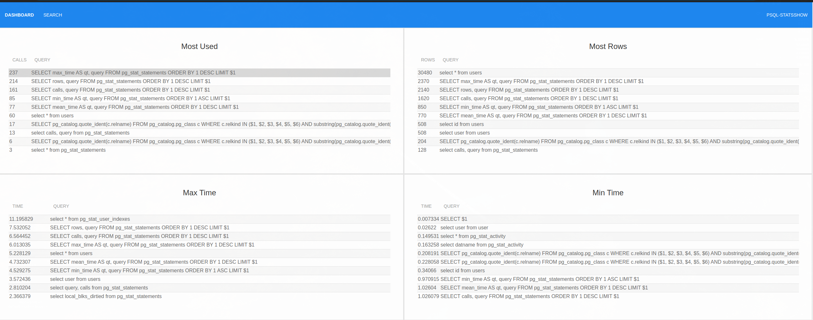

# PSQL StatsShow

[](https://npmjs.org/package/psqlstatsshow) [](https://npmjs.org/package/psqlstatsshow) [](https://npmjs.org/package/psqlstatsshow) [](https://github.com/xojs/xo) 

Web Monitoring PostgreSQL- Tracking execution statistics of all SQL statements executed by a server.

<p align="center"></p>

## Installation

Module available through the [npm registry](https://www.npmjs.com/). It can be installed using the  [`npm`](https://docs.npmjs.com/getting-started/installing-npm-packages-locally) or [`yarn`](https://yarnpkg.com/en/) command line tools.

```sh
# NPM
npm install psqlstatsshow --global
# Or Using Yarn
yarn global add psqlstatsshow
```

## Usage

```sh
# Start (enabled https://www.postgresql.org/docs/11/pgstatstatements.html)
psqlstatsshow --password=12345
```

## Tests

To run the test suite, first install the dependencies, then run `test`:

```sh
# NPM
npm test
# Or Using Yarn
yarn test
```

## Dependencies

<details>
	<summary><a href="https://ghub.io/body-parser">body-parser</a>: Node.js body parsing middleware</summary>
	<b>Author</b>: dougwilson</br>
	<b>License</b>: MIT</br>
	<b>Version</b>: ^1.19.0
</details>
<details>
	<summary><a href="https://ghub.io/cookie-session">cookie-session</a>: cookie session middleware</summary>
	<b>Author</b>: fishrock123, tjholowaychuk, dougwilson, jongleberry, defunctzombie</br>
	<b>License</b>: MIT</br>
	<b>Version</b>: ^2.0.0-beta.3
</details>
<details>
	<summary><a href="https://ghub.io/express">express</a>: Fast, unopinionated, minimalist web framework</summary>
	<b>Author</b>: TJ Holowaychuk</br>
	<b>License</b>: MIT</br>
	<b>Version</b>: ^4.17.1
</details>
<details>
	<summary><a href="https://ghub.io/express-handlebars">express-handlebars</a>: A Handlebars view engine for Express which doesn&#x27;t suck.</summary>
	<b>Author</b>: Eric Ferraiuolo</br>
	<b>License</b>: BSD-3-Clause</br>
	<b>Version</b>: 3.1.0
</details>
<details>
	<summary><a href="https://ghub.io/minimist">minimist</a>: parse argument options</summary>
	<b>Author</b>: James Halliday</br>
	<b>License</b>: MIT</br>
	<b>Version</b>: ^1.2.0
</details>
<details>
	<summary><a href="https://ghub.io/uikit">uikit</a>: UIkit is a lightweight and modular front-end framework for developing fast and powerful web interfaces.</summary>
	<b>Author</b>: aheinze, janschoenherr, saschadube</br>
	<b>License</b>: MIT</br>
	<b>Version</b>: ^3.1.6
</details>
<details>
	<summary><a href="https://ghub.io/handlebars-helpers">handlebars-helpers</a>: More than 130 Handlebars helpers in ~20 categories. Helpers can be used with Assemble, Generate, Verb, Ghost, gulp-handlebars, grunt-handlebars, consolidate, or any node.js/Handlebars project.</summary>
	<b>Author</b>: Jon Schlinkert</br>
	<b>License</b>: MIT</br>
	<b>Version</b>: ^0.10.0
</details>
<details>
	<summary><a href="https://ghub.io/pg">pg</a>: PostgreSQL client - pure javascript &amp; libpq with the same API</summary>
	<b>Author</b>: Brian Carlson</br>
	<b>License</b>: MIT</br>
	<b>Version</b>: 7.14.0
</details>
<details>
	<summary><a href="https://ghub.io/pg-native">pg-native</a>: A slightly nicer interface to Postgres over node-libpq</summary>
	<b>Author</b>: Brian M. Carlson</br>
	<b>License</b>: MIT</br>
	<b>Version</b>: 3.0.0
</details>

## Dev Dependencies

<details>
	<summary><a href="https://ghub.io/nodemon">nodemon</a>: Simple monitor script for use during development of a node.js app.</summary>
	<b>Author</b>: Remy Sharp</br>
	<b>License</b>: MIT</br>
	<b>Version</b>: ^2.0.1
</details>
<details>
	<summary><a href="https://ghub.io/reload">reload</a>: Node.js module to refresh and reload your code in your browser when your code changes. No browser plugins required.</summary>
	<b>Author</b>: JP Richardson</br>
	<b>License</b>: MIT</br>
	<b>Version</b>: ^3.0.3
</details>
<details>
	<summary><a href="https://ghub.io/xo">xo</a>: JavaScript linter with great defaults</summary>
	<b>Author</b>: Sindre Sorhus</br>
	<b>License</b>: MIT</br>
	<b>Version</b>: 0.25.3
</details>

## Contributors

Pull requests and stars are always welcome. For bugs and feature requests, please [create an issue](https://github.com/TiagoDanin/PSQL-StatsShow/issues). [List of all contributors](https://github.com/TiagoDanin/PSQL-StatsShow/graphs/contributors).

## License

[MIT](LICENSE) © [Tiago Danin](https://TiagoDanin.github.io)